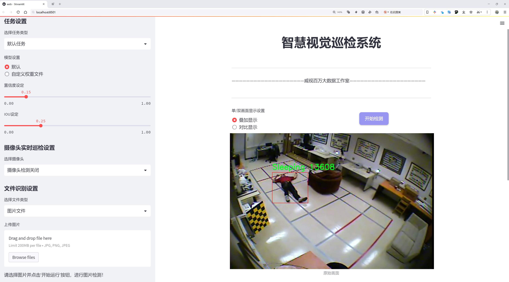
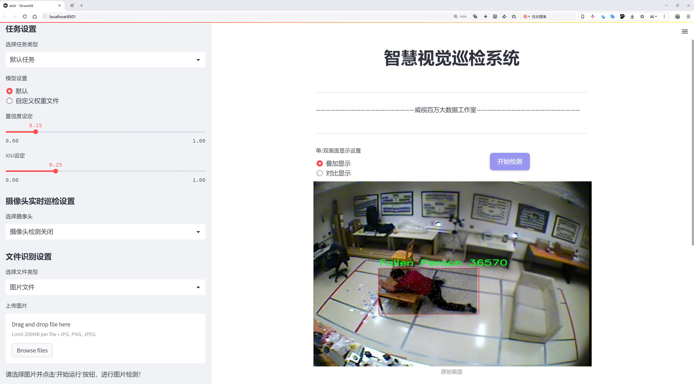
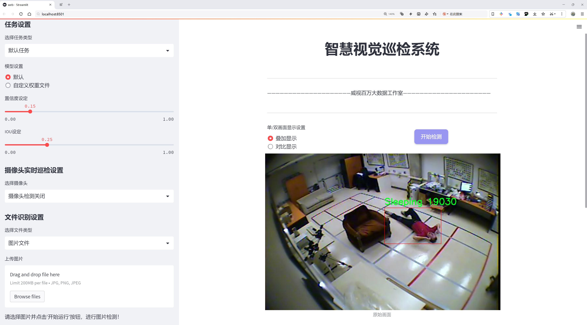
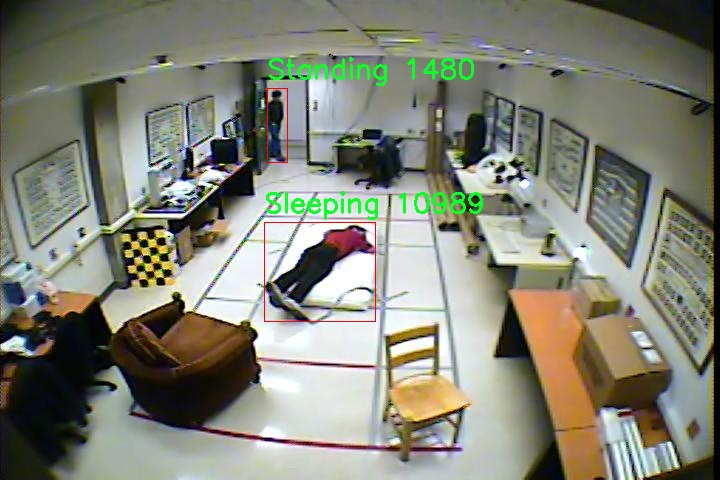
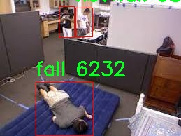
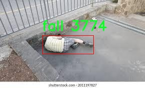
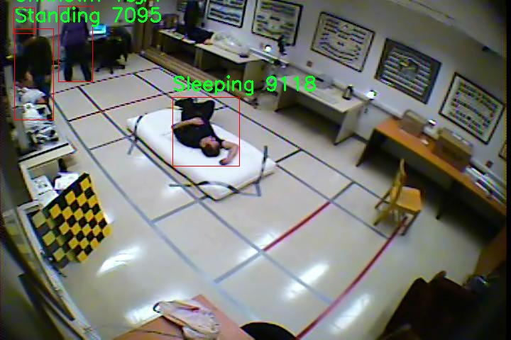
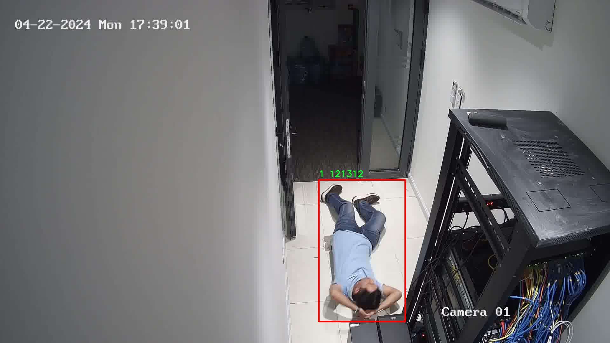

# 姿态识别与跌倒检测检测系统源码分享
 # [一条龙教学YOLOV8标注好的数据集一键训练_70+全套改进创新点发刊_Web前端展示]

### 1.研究背景与意义

项目参考[AAAI Association for the Advancement of Artificial Intelligence](https://gitee.com/qunshansj/projects)

项目来源[AACV Association for the Advancement of Computer Vision](https://gitee.com/qunmasj/projects)

研究背景与意义

随着人口老龄化的加剧，跌倒已成为老年人群体中一种常见且严重的健康问题。根据世界卫生组织的统计，全球每年约有三分之一的老年人经历跌倒事件，导致严重的身体伤害和心理创伤。因此，开发有效的跌倒检测系统，能够及时识别和响应跌倒事件，对于提高老年人的生活质量和安全性具有重要意义。近年来，计算机视觉技术的快速发展为姿态识别和跌倒检测提供了新的解决方案。尤其是基于深度学习的目标检测算法，如YOLO（You Only Look Once），因其高效性和准确性，逐渐成为研究的热点。

本研究旨在基于改进的YOLOv8模型，构建一个高效的姿态识别与跌倒检测系统。YOLOv8作为YOLO系列的最新版本，具有更快的推理速度和更高的检测精度，适合实时应用场景。通过对YOLOv8的改进，我们希望能够进一步提升其在复杂环境下的检测能力，以适应老年人日常生活中可能出现的多种姿态变化。我们的研究将使用一个包含4500张图像的数据集，该数据集涵盖了10个类别，包括“跌倒的人”、“正在跌倒”、“跪着”、“坐着”、“躺着”、“站着”、“未知”、“跌倒”和“未跌倒”等。这些类别的设置不仅能够帮助系统识别跌倒事件，还能分析老年人在不同状态下的姿态变化，为后续的干预措施提供数据支持。

在数据集的构建过程中，我们充分考虑了老年人的日常活动场景，确保数据的多样性和代表性。这种丰富的数据来源将为模型的训练提供坚实的基础，使其能够在实际应用中具备更强的适应性和鲁棒性。此外，结合姿态识别技术，我们的系统不仅能够识别跌倒事件，还能监测老年人的日常活动，及时发现潜在的风险，提供更为全面的安全保障。

本研究的意义不仅在于技术上的创新，更在于其社会价值。通过构建一个高效的姿态识别与跌倒检测系统，我们希望能够为老年人提供更为安全的生活环境，降低跌倒带来的健康风险。同时，该系统的应用也可以减轻护理人员的工作负担，提高老年护理的效率。随着智能家居和物联网技术的发展，将我们的系统与智能设备相结合，能够实现更为智能化的监测和响应机制，为老年人提供更为全面的关怀。

综上所述，基于改进YOLOv8的姿态识别与跌倒检测系统的研究，不仅具有重要的学术价值，更具备广泛的应用前景。通过深入探讨和解决老年人跌倒问题，我们期望能够为社会的可持续发展贡献一份力量。

### 2.图片演示







##### 注意：由于此博客编辑较早，上面“2.图片演示”和“3.视频演示”展示的系统图片或者视频可能为老版本，新版本在老版本的基础上升级如下：（实际效果以升级的新版本为准）

  （1）适配了YOLOV8的“目标检测”模型和“实例分割”模型，通过加载相应的权重（.pt）文件即可自适应加载模型。

  （2）支持“图片识别”、“视频识别”、“摄像头实时识别”三种识别模式。

  （3）支持“图片识别”、“视频识别”、“摄像头实时识别”三种识别结果保存导出，解决手动导出（容易卡顿出现爆内存）存在的问题，识别完自动保存结果并导出到tempDir中。

  （4）支持Web前端系统中的标题、背景图等自定义修改，后面提供修改教程。

  另外本项目提供训练的数据集和训练教程,暂不提供权重文件（best.pt）,需要您按照教程进行训练后实现图片演示和Web前端界面演示的效果。

### 3.视频演示

[3.1 视频演示](https://www.bilibili.com/video/BV1actXecEHM/)

### 4.数据集信息展示

##### 4.1 本项目数据集详细数据（类别数＆类别名）

nc: 10
names: ['1', 'Fallen Person', 'Falling', 'Kneeling', 'Sitting', 'Sleeping', 'Standing', 'Unknown', 'fall', 'not fall']


##### 4.2 本项目数据集信息介绍

数据集信息展示

在本研究中，我们使用了名为“lying”的数据集，旨在改进YOLOv8模型在姿态识别与跌倒检测系统中的表现。该数据集专门设计用于捕捉和分析与人类姿态相关的多种状态，尤其是在老年人群体中，跌倒事件的检测至关重要。数据集的类别数量为10，涵盖了多种与姿态相关的行为，具体类别包括：‘1’、‘Fallen Person’、‘Falling’、‘Kneeling’、‘Sitting’、‘Sleeping’、‘Standing’、‘Unknown’、‘fall’和‘not fall’。

数据集中的每个类别都代表了一种特定的姿态或状态，这些状态在实际应用中具有重要的临床和社会意义。例如，“Fallen Person”类别专门用于标识已经跌倒的个体，而“Falling”则表示正在跌倒的过程。这两个类别的准确识别对于及时采取救助措施至关重要。与此同时，“Kneeling”、“Sitting”、“Sleeping”和“Standing”这些类别则涵盖了日常生活中常见的姿态，这些信息对于构建一个全面的姿态识别系统至关重要。

“Unknown”类别的引入则为模型提供了处理不确定性和异常情况的能力。在实际应用中，可能会遇到一些姿态不明确的情况，能够有效识别这些未知状态将大大增强系统的鲁棒性。此外，“fall”和“not fall”这两个类别的存在使得模型能够更好地进行二分类判断，明确区分出潜在的跌倒风险和安全状态。

在数据集的构建过程中，考虑到了多样性和代表性，确保数据能够覆盖不同的环境、光照条件和个体差异。这种多样性不仅提高了模型的泛化能力，还使得其在不同场景下的应用更加灵活。通过对这些姿态的准确识别，系统能够实时监测个体的状态，及时发出警报，减少跌倒带来的伤害风险。

在训练过程中，我们将利用这些类别信息进行数据标注和模型优化。通过对不同姿态的深入学习，YOLOv8模型将能够更准确地识别和分类各种姿态，为跌倒检测提供强有力的支持。数据集的设计不仅关注姿态的静态特征，还考虑了动态变化，确保模型能够在实际应用中应对复杂的行为模式。

总之，“lying”数据集为姿态识别与跌倒检测系统的研究提供了丰富的基础数据，涵盖了多种关键姿态类别。通过对这些数据的深入分析和学习，我们期望能够显著提升YOLOv8模型在实际应用中的表现，为老年人群体的安全监护提供更为有效的技术支持。











### 5.全套项目环境部署视频教程（零基础手把手教学）

[5.1 环境部署教程链接（零基础手把手教学）](https://www.ixigua.com/7404473917358506534?logTag=c807d0cbc21c0ef59de5)


[5.2 安装Python虚拟环境创建和依赖库安装视频教程链接（零基础手把手教学）](https://www.ixigua.com/7404474678003106304?logTag=1f1041108cd1f708b01a)

### 6.手把手YOLOV8训练视频教程（零基础小白有手就能学会）

[6.1 手把手YOLOV8训练视频教程（零基础小白有手就能学会）](https://www.ixigua.com/7404477157818401292?logTag=d31a2dfd1983c9668658)

### 7.70+种全套YOLOV8创新点代码加载调参视频教程（一键加载写好的改进模型的配置文件）

[7.1 70+种全套YOLOV8创新点代码加载调参视频教程（一键加载写好的改进模型的配置文件）](https://www.ixigua.com/7404478314661806627?logTag=29066f8288e3f4eea3a4)

### 8.70+种全套YOLOV8创新点原理讲解（非科班也可以轻松写刊发刊，V10版本正在科研待更新）

由于篇幅限制，每个创新点的具体原理讲解就不一一展开，具体见下列网址中的创新点对应子项目的技术原理博客网址【Blog】：


[8.1 70+种全套YOLOV8创新点原理讲解链接](https://gitee.com/qunmasj/good)

### 9.系统功能展示（检测对象为举例，实际内容以本项目数据集为准）

图9.1.系统支持检测结果表格显示

  图9.2.系统支持置信度和IOU阈值手动调节

  图9.3.系统支持自定义加载权重文件best.pt(需要你通过步骤5中训练获得)

  图9.4.系统支持摄像头实时识别

  图9.5.系统支持图片识别

  图9.6.系统支持视频识别

  图9.7.系统支持识别结果文件自动保存

  图9.8.系统支持Excel导出检测结果数据


### 10.原始YOLOV8算法原理

原始YOLOv8算法原理

YOLOv8作为目标检测领域的最新版本，继承并发展了YOLO系列算法的核心思想，致力于在保持高效性的同时提升检测精度。该算法的架构由输入层、主干网络、颈部网络和头部网络四个主要组件构成，每个部分在整体模型中扮演着至关重要的角色。

在YOLOv8的工作流程中，首先，输入图像会被缩放至指定的尺寸，以确保其适配后续的处理步骤。主干网络是YOLOv8的特征提取核心，通过一系列卷积操作对输入图像进行下采样，提取出丰富的特征信息。每个卷积层不仅应用了批归一化（Batch Normalization）来加速训练过程，还采用了SiLU（Sigmoid Linear Unit）激活函数，增强了网络的非线性表达能力。主干网络的设计充分考虑了特征提取的多样性和深度，利用C2f块进一步提升特征的表达能力。C2f块借鉴了YOLOv7中的E-ELAN结构，通过跨层分支连接来增强模型的梯度流，确保在特征传递过程中信息的充分保留与利用。这种设计使得YOLOv8在处理复杂场景时，能够有效捕捉到多层次的特征信息，从而改善最终的检测结果。

在主干网络的末尾，YOLOv8引入了SPPFl（Spatial Pyramid Pooling with Focal Loss）块，采用三个最大池化层来处理多尺度特征。这一模块的设计意在增强网络的特征抽象能力，使得模型在面对不同尺度的目标时，能够保持良好的检测性能。通过这种多尺度特征处理，YOLOv8能够在各种场景下实现高效的目标检测。

颈部网络是YOLOv8的重要组成部分，采用了FPNS（Feature Pyramid Network）和PAN（Path Aggregation Network）结构，旨在融合来自不同尺度特征图的信息。FPNS通过自上而下的特征融合，增强了高层特征的细节信息，而PAN则通过自下而上的特征聚合，确保低层特征的丰富性。这种多层次特征融合的策略，使得YOLOv8在处理复杂场景时，能够有效地整合各层特征，从而提升检测的准确性和鲁棒性。

最后，YOLOv8的头部网络采用了解耦的检测头结构，将分类和回归任务分开处理。这一创新设计不仅提高了模型的灵活性，还有效降低了不同任务之间的干扰。此外，YOLOv8摒弃了传统的Anchor-Based方法，转而采用Anchor-Free的策略，使得模型在处理目标时更加灵活和高效。在训练过程中，YOLOv8引入了动态Task-Aligned Assigner样本分配策略，并在最后10个epoch中关闭马赛克增强，以提高模型的训练稳定性和最终的检测性能。

在损失计算方面，YOLOv8采用了BCELoss作为分类损失，DFLLoss和CIoULoss作为回归损失。这种损失函数的选择旨在平衡分类和回归任务的优化，使得模型在目标检测时能够同时兼顾准确性和鲁棒性。

总的来说，YOLOv8通过对主干网络、颈部网络和头部网络的创新设计，结合多种先进的技术手段，极大地提升了目标检测的性能。其在特征提取、特征融合和损失计算等方面的改进，使得YOLOv8在复杂场景下依然能够保持高效的检测能力，成为目标检测领域的重要里程碑。通过不断优化和创新，YOLOv8不仅为研究人员提供了一个强大的工具，也为实际应用中的目标检测任务提供了更为精准和高效的解决方案。


### 11.项目核心源码讲解（再也不用担心看不懂代码逻辑）

#### 11.1 code\ultralytics\data\annotator.py

以下是对给定代码的核心部分进行提炼和详细注释的结果：

```python
# 导入必要的库
from pathlib import Path
from ultralytics import SAM, YOLO

def auto_annotate(data, det_model="yolov8x.pt", sam_model="sam_b.pt", device="", output_dir=None):
    """
    自动为图像添加注释，使用YOLO目标检测模型和SAM分割模型。

    参数:
        data (str): 包含待注释图像的文件夹路径。
        det_model (str, optional): 预训练的YOLO检测模型，默认为'yolov8x.pt'。
        sam_model (str, optional): 预训练的SAM分割模型，默认为'sam_b.pt'。
        device (str, optional): 运行模型的设备，默认为空字符串（CPU或可用的GPU）。
        output_dir (str | None | optional): 保存注释结果的目录。
            默认为与'data'相同目录下的'labels'文件夹。

    示例:
        auto_annotate(data='ultralytics/assets', det_model='yolov8n.pt', sam_model='mobile_sam.pt')
    """
    # 加载YOLO目标检测模型
    det_model = YOLO(det_model)
    # 加载SAM分割模型
    sam_model = SAM(sam_model)

    # 将数据路径转换为Path对象
    data = Path(data)
    # 如果未指定输出目录，则创建一个默认的输出目录
    if not output_dir:
        output_dir = data.parent / f"{data.stem}_auto_annotate_labels"
    # 创建输出目录（如果不存在）
    Path(output_dir).mkdir(exist_ok=True, parents=True)

    # 使用YOLO模型进行目标检测，stream=True表示流式处理
    det_results = det_model(data, stream=True, device=device)

    # 遍历检测结果
    for result in det_results:
        # 获取检测到的类别ID
        class_ids = result.boxes.cls.int().tolist()  # 将类别ID转换为整数列表
        if len(class_ids):  # 如果检测到类别
            # 获取边界框坐标
            boxes = result.boxes.xyxy  # 获取边界框的xyxy坐标
            # 使用SAM模型进行分割，传入边界框
            sam_results = sam_model(result.orig_img, bboxes=boxes, verbose=False, save=False, device=device)
            # 获取分割结果
            segments = sam_results[0].masks.xyn  # 获取分割掩码

            # 将分割结果写入文本文件
            with open(f"{Path(output_dir) / Path(result.path).stem}.txt", "w") as f:
                for i in range(len(segments)):
                    s = segments[i]  # 获取第i个分割结果
                    if len(s) == 0:  # 如果分割结果为空，则跳过
                        continue
                    # 将分割结果转换为字符串并写入文件
                    segment = map(str, segments[i].reshape(-1).tolist())
                    f.write(f"{class_ids[i]} " + " ".join(segment) + "\n")  # 写入类别ID和分割坐标
```

### 代码核心部分说明：
1. **模型加载**：加载YOLO和SAM模型，用于目标检测和图像分割。
2. **输出目录管理**：根据输入数据路径创建输出目录，确保结果能够被保存。
3. **目标检测**：使用YOLO模型对输入图像进行目标检测，获取检测结果。
4. **图像分割**：对检测到的目标区域使用SAM模型进行分割，获取分割掩码。
5. **结果保存**：将分割结果和对应的类别ID写入文本文件，便于后续使用。

这些部分构成了自动注释功能的核心逻辑。

这个文件是一个用于自动标注图像的程序，主要依赖于YOLO（You Only Look Once）目标检测模型和SAM（Segment Anything Model）分割模型。其核心功能是对指定文件夹中的图像进行处理，生成相应的标注文件。

首先，程序导入了必要的库，包括`Path`用于处理文件路径，以及`SAM`和`YOLO`模型类。接着定义了一个名为`auto_annotate`的函数，该函数接受多个参数：

- `data`：一个字符串，表示包含待标注图像的文件夹路径。
- `det_model`：一个可选参数，指定预训练的YOLO检测模型，默认值为'yolov8x.pt'。
- `sam_model`：一个可选参数，指定预训练的SAM分割模型，默认值为'sam_b.pt'。
- `device`：一个可选参数，指定模型运行的设备，默认为空字符串（表示使用CPU或可用的GPU）。
- `output_dir`：一个可选参数，指定保存标注结果的目录。如果未提供，默认会在`data`目录下创建一个名为"{data文件夹名}_auto_annotate_labels"的文件夹。

在函数内部，首先实例化YOLO和SAM模型。然后将`data`转换为`Path`对象，以便于后续的路径操作。如果未指定输出目录，则创建一个新的目录用于保存标注结果。

接下来，程序使用YOLO模型对输入数据进行检测，`det_model(data, stream=True, device=device)`会返回检测结果。对于每个检测结果，程序提取出类别ID和边界框信息。如果检测到目标，程序会调用SAM模型进行分割，传入原始图像和检测到的边界框。分割结果存储在`segments`中。

最后，程序将每个图像的分割结果写入到一个文本文件中，文件名与原始图像相同，后缀为`.txt`。每一行包含类别ID和对应的分割坐标信息。

总的来说，这个程序通过结合YOLO和SAM模型，实现了对图像的自动标注，方便用户快速生成标注数据。

#### 11.2 70+种YOLOv8算法改进源码大全和调试加载训练教程（非必要）\ultralytics\trackers\utils\gmc.py

以下是经过简化和注释的核心代码部分，主要集中在 `GMC` 类及其关键方法上：

```python
import cv2
import numpy as np
from ultralytics.utils import LOGGER

class GMC:
    """
    通用运动补偿 (GMC) 类，用于视频帧中的跟踪和物体检测。
    """

    def __init__(self, method='sparseOptFlow', downscale=2):
        """初始化 GMC 对象，设置跟踪方法和缩放因子。"""
        self.method = method  # 设置跟踪方法
        self.downscale = max(1, int(downscale))  # 设置缩放因子，确保至少为1

        # 根据选择的方法初始化相应的检测器和匹配器
        if self.method == 'orb':
            self.detector = cv2.FastFeatureDetector_create(20)
            self.extractor = cv2.ORB_create()
            self.matcher = cv2.BFMatcher(cv2.NORM_HAMMING)
        elif self.method == 'sift':
            self.detector = cv2.SIFT_create()
            self.extractor = cv2.SIFT_create()
            self.matcher = cv2.BFMatcher(cv2.NORM_L2)
        elif self.method == 'ecc':
            self.warp_mode = cv2.MOTION_EUCLIDEAN
            self.criteria = (cv2.TERM_CRITERIA_EPS | cv2.TERM_CRITERIA_COUNT, 5000, 1e-6)
        elif self.method == 'sparseOptFlow':
            self.feature_params = dict(maxCorners=1000, qualityLevel=0.01, minDistance=1, blockSize=3)
        elif self.method in ['none', 'None', None]:
            self.method = None
        else:
            raise ValueError(f'未知的 GMC 方法: {method}')

        # 初始化变量
        self.prevFrame = None
        self.prevKeyPoints = None
        self.prevDescriptors = None
        self.initializedFirstFrame = False  # 标记是否已处理第一帧

    def apply(self, raw_frame, detections=None):
        """根据选择的方法在原始帧上应用物体检测。"""
        if self.method in ['orb', 'sift']:
            return self.applyFeatures(raw_frame, detections)
        elif self.method == 'ecc':
            return self.applyEcc(raw_frame, detections)
        elif self.method == 'sparseOptFlow':
            return self.applySparseOptFlow(raw_frame, detections)
        else:
            return np.eye(2, 3)  # 返回单位矩阵

    def applyEcc(self, raw_frame, detections=None):
        """应用ECC算法进行运动补偿。"""
        height, width, _ = raw_frame.shape
        frame = cv2.cvtColor(raw_frame, cv2.COLOR_BGR2GRAY)  # 转换为灰度图
        H = np.eye(2, 3, dtype=np.float32)  # 初始化变换矩阵

        # 根据缩放因子缩小图像
        if self.downscale > 1.0:
            frame = cv2.resize(frame, (width // self.downscale, height // self.downscale))

        # 处理第一帧
        if not self.initializedFirstFrame:
            self.prevFrame = frame.copy()  # 保存当前帧
            self.initializedFirstFrame = True  # 标记已初始化
            return H

        # 运行ECC算法，计算变换矩阵
        try:
            (cc, H) = cv2.findTransformECC(self.prevFrame, frame, H, self.warp_mode, self.criteria)
        except Exception as e:
            LOGGER.warning(f'找不到变换，使用单位矩阵: {e}')

        return H

    def applyFeatures(self, raw_frame, detections=None):
        """应用特征检测方法（如ORB或SIFT）。"""
        height, width, _ = raw_frame.shape
        frame = cv2.cvtColor(raw_frame, cv2.COLOR_BGR2GRAY)  # 转换为灰度图
        H = np.eye(2, 3)

        # 缩小图像
        if self.downscale > 1.0:
            frame = cv2.resize(frame, (width // self.downscale, height // self.downscale))

        # 检测关键点
        keypoints = self.detector.detect(frame)

        # 处理第一帧
        if not self.initializedFirstFrame:
            self.prevFrame = frame.copy()
            self.prevKeyPoints = copy.copy(keypoints)
            self.initializedFirstFrame = True
            return H

        # 匹配描述符
        knnMatches = self.matcher.knnMatch(self.prevDescriptors, descriptors, 2)
        # 过滤匹配
        goodMatches = [m for m, n in knnMatches if m.distance < 0.9 * n.distance]

        # 计算变换矩阵
        if len(goodMatches) > 4:
            prevPoints = np.array([self.prevKeyPoints[m.queryIdx].pt for m in goodMatches])
            currPoints = np.array([keypoints[m.trainIdx].pt for m in goodMatches])
            H, _ = cv2.estimateAffinePartial2D(prevPoints, currPoints, cv2.RANSAC)

        # 保存当前帧和关键点
        self.prevFrame = frame.copy()
        self.prevKeyPoints = copy.copy(keypoints)

        return H

    def applySparseOptFlow(self, raw_frame, detections=None):
        """应用稀疏光流法进行运动补偿。"""
        height, width, _ = raw_frame.shape
        frame = cv2.cvtColor(raw_frame, cv2.COLOR_BGR2GRAY)
        H = np.eye(2, 3)

        # 缩小图像
        if self.downscale > 1.0:
            frame = cv2.resize(frame, (width // self.downscale, height // self.downscale))

        # 检测关键点
        keypoints = cv2.goodFeaturesToTrack(frame, mask=None, **self.feature_params)

        # 处理第一帧
        if not self.initializedFirstFrame:
            self.prevFrame = frame.copy()
            self.prevKeyPoints = copy.copy(keypoints)
            self.initializedFirstFrame = True
            return H

        # 计算光流
        matchedKeypoints, status, _ = cv2.calcOpticalFlowPyrLK(self.prevFrame, frame, self.prevKeyPoints, None)

        # 过滤有效的匹配点
        prevPoints = np.array([self.prevKeyPoints[i] for i in range(len(status)) if status[i]])
        currPoints = np.array([matchedKeypoints[i] for i in range(len(status)) if status[i]])

        # 计算变换矩阵
        if len(prevPoints) > 4:
            H, _ = cv2.estimateAffinePartial2D(prevPoints, currPoints, cv2.RANSAC)

        # 保存当前帧和关键点
        self.prevFrame = frame.copy()
        self.prevKeyPoints = copy.copy(keypoints)

        return H
```

### 代码注释说明：
1. **类定义**：`GMC` 类用于实现视频帧中的运动补偿和物体检测。
2. **初始化方法**：根据选择的跟踪方法初始化相应的检测器和匹配器，并设置缩放因子。
3. **apply 方法**：根据选择的方法调用相应的处理函数。
4. **applyEcc 方法**：实现了基于ECC算法的运动补偿，处理第一帧时初始化数据。
5. **applyFeatures 方法**：实现了基于特征的运动补偿，使用ORB或SIFT检测关键点并匹配描述符。
6. **applySparseOptFlow 方法**：实现了稀疏光流法的运动补偿，计算光流并匹配关键点。

以上代码及注释为核心功能的实现，提供了对视频帧进行运动补偿的基本框架。

这个程序文件定义了一个名为 `GMC` 的类，主要用于视频帧中的目标跟踪和检测。该类实现了多种跟踪算法，包括 ORB、SIFT、ECC 和稀疏光流，并支持对帧进行下采样以提高计算效率。

在类的初始化方法 `__init__` 中，用户可以指定跟踪方法和下采样因子。根据所选的方法，程序会初始化相应的特征检测器、描述符提取器和匹配器。例如，使用 ORB 方法时，会创建一个快速特征检测器和 ORB 描述符提取器；使用 SIFT 方法时，则会创建 SIFT 特征检测器和描述符提取器；而对于 ECC 方法，则会设置相关的迭代次数和终止条件。

类中有多个方法，其中 `apply` 方法根据指定的跟踪方法对输入的原始帧进行处理。它会调用相应的处理方法，如 `applyEcc`、`applyFeatures` 或 `applySparseOptFlow`，以实现不同的跟踪策略。

`applyEcc` 方法实现了基于增强互相关（ECC）算法的跟踪。它首先将输入帧转换为灰度图像，并根据下采样因子对图像进行处理。对于第一帧，程序会初始化先前帧的存储；对于后续帧，则会使用 `cv2.findTransformECC` 函数计算变换矩阵。

`applyFeatures` 方法则是基于特征的跟踪。它会检测关键点并计算描述符，然后通过 K 最近邻匹配来找到对应的关键点。通过过滤匹配结果，程序可以计算出一个刚性变换矩阵，并将当前帧的关键点和描述符存储以备下次使用。

`applySparseOptFlow` 方法实现了稀疏光流法。它使用 `cv2.goodFeaturesToTrack` 函数找到关键点，并通过 `cv2.calcOpticalFlowPyrLK` 计算光流，得到前后帧之间的对应关系。

总的来说，这个类提供了一种灵活的方式来实现视频中的目标跟踪，用户可以根据需要选择不同的跟踪算法，并通过下采样来提高处理效率。每种方法都考虑了第一帧的初始化和后续帧的处理逻辑，以确保跟踪的连续性和准确性。

#### 11.3 ui.py

```python
import sys
import subprocess

def run_script(script_path):
    """
    使用当前 Python 环境运行指定的脚本。

    Args:
        script_path (str): 要运行的脚本路径

    Returns:
        None
    """
    # 获取当前 Python 解释器的路径
    python_path = sys.executable

    # 构建运行命令，使用 streamlit 运行指定的脚本
    command = f'"{python_path}" -m streamlit run "{script_path}"'

    # 执行命令并等待其完成
    result = subprocess.run(command, shell=True)
    
    # 检查命令执行结果，如果返回码不为0，表示出错
    if result.returncode != 0:
        print("脚本运行出错。")


# 实例化并运行应用
if __name__ == "__main__":
    # 指定要运行的脚本路径
    script_path = "web.py"  # 假设脚本在当前目录下

    # 调用函数运行脚本
    run_script(script_path)
```

### 代码注释说明：
1. **导入模块**：
   - `sys`：用于访问与 Python 解释器相关的变量和函数。
   - `subprocess`：用于创建新进程、连接到它们的输入/输出/错误管道，并获得返回码。

2. **定义 `run_script` 函数**：
   - 该函数接收一个脚本路径作为参数，并使用当前 Python 环境运行该脚本。

3. **获取 Python 解释器路径**：
   - `sys.executable`：获取当前 Python 解释器的完整路径，以便后续调用。

4. **构建命令**：
   - 使用 `streamlit` 模块运行指定的脚本，构建一个命令字符串。

5. **执行命令**：
   - `subprocess.run`：执行构建的命令，并等待其完成。`shell=True` 允许在 shell 中执行命令。

6. **检查执行结果**：
   - 通过检查 `result.returncode` 来判断命令是否成功执行。如果返回码不为0，表示执行过程中出现错误。

7. **主程序入口**：
   - 使用 `if __name__ == "__main__":` 确保只有在直接运行该脚本时才会执行以下代码。
   - 指定要运行的脚本路径（这里假设为 "web.py"）。
   - 调用 `run_script` 函数来运行指定的脚本。

这个程序文件名为 `ui.py`，主要功能是通过当前的 Python 环境运行一个指定的脚本，具体是使用 Streamlit 来启动一个 Web 应用。

首先，程序导入了几个必要的模块，包括 `sys`、`os` 和 `subprocess`。其中，`sys` 模块用于访问与 Python 解释器相关的变量和函数，`os` 模块提供了与操作系统交互的功能，而 `subprocess` 模块则用于执行外部命令。

接着，程序从 `QtFusion.path` 模块中导入了 `abs_path` 函数，这个函数的作用是获取给定路径的绝对路径。

在 `run_script` 函数中，程序接收一个参数 `script_path`，这是要运行的脚本的路径。函数首先获取当前 Python 解释器的路径，并将其存储在 `python_path` 变量中。然后，构建一个命令字符串，使用 `streamlit run` 命令来运行指定的脚本。这里使用了格式化字符串，确保路径和命令都被正确引用。

随后，程序通过 `subprocess.run` 方法执行构建好的命令。如果命令执行的返回码不为 0，表示脚本运行出错，程序会输出一条错误信息。

在文件的最后部分，使用 `if __name__ == "__main__":` 来判断当前模块是否是主程序。若是，则指定要运行的脚本路径，这里使用 `abs_path` 函数获取 `web.py` 的绝对路径，并调用 `run_script` 函数来执行这个脚本。

总体来看，这个程序的设计目的是为了方便地启动一个 Streamlit Web 应用，通过简单的命令行调用来实现。

#### 11.4 70+种YOLOv8算法改进源码大全和调试加载训练教程（非必要）\ultralytics\models\yolo\detect\__init__.py

以下是保留的核心代码部分，并附上详细的中文注释：

```python
# 导入所需的模块
from .predict import DetectionPredictor  # 导入目标检测预测器
from .train import DetectionTrainer      # 导入目标检测训练器
from .val import DetectionValidator      # 导入目标检测验证器

# 定义模块的公开接口，包含三个核心类
__all__ = 'DetectionPredictor', 'DetectionTrainer', 'DetectionValidator'
```

### 代码详细注释：

1. **导入模块**：
   - `from .predict import DetectionPredictor`：从当前包的 `predict` 模块中导入 `DetectionPredictor` 类，该类负责处理目标检测的预测任务。
   - `from .train import DetectionTrainer`：从当前包的 `train` 模块中导入 `DetectionTrainer` 类，该类用于训练目标检测模型。
   - `from .val import DetectionValidator`：从当前包的 `val` 模块中导入 `DetectionValidator` 类，该类用于验证目标检测模型的性能。

2. **定义公开接口**：
   - `__all__ = 'DetectionPredictor', 'DetectionTrainer', 'DetectionValidator'`：定义了模块的公开接口，表示当使用 `from module import *` 时，只会导入这三个类。这有助于控制模块的可见性，避免不必要的内部实现细节被外部访问。

这个程序文件是Ultralytics YOLO（You Only Look Once）算法的一部分，主要用于目标检测任务。文件的功能是导入和组织与目标检测相关的几个核心组件，包括预测、训练和验证模块。

首先，文件开头的注释表明该代码遵循AGPL-3.0许可证，意味着用户可以自由使用和修改代码，但需要遵循相应的开源协议。

接下来，文件通过相对导入的方式引入了三个重要的类：`DetectionPredictor`、`DetectionTrainer`和`DetectionValidator`。这些类分别负责目标检测的不同阶段：

1. `DetectionPredictor`：这个类用于进行目标检测的预测，能够处理输入数据并输出检测结果。
2. `DetectionTrainer`：这个类负责模型的训练过程，包括数据加载、模型优化和损失计算等。
3. `DetectionValidator`：这个类用于验证训练后的模型性能，通常通过在验证集上评估模型的准确性和其他指标来实现。

最后，`__all__`变量定义了该模块的公共接口，指定了在使用`from module import *`时，哪些类会被导入。这里列出的三个类表明它们是该模块的主要功能部分，用户可以直接使用这些类进行目标检测相关的操作。

总体来说，这个文件是YOLOv8目标检测框架的一个基础模块，负责整合和提供模型预测、训练和验证的功能。

#### 11.5 train.py

以下是经过简化和注释的核心代码部分，主要保留了与YOLO模型训练相关的功能：

```python
import random
import numpy as np
import torch.nn as nn
from ultralytics.data import build_dataloader, build_yolo_dataset
from ultralytics.engine.trainer import BaseTrainer
from ultralytics.models import yolo
from ultralytics.nn.tasks import DetectionModel
from ultralytics.utils import LOGGER, RANK
from ultralytics.utils.torch_utils import de_parallel, torch_distributed_zero_first

class DetectionTrainer(BaseTrainer):
    """
    扩展自BaseTrainer类，用于基于检测模型的训练。
    """

    def build_dataset(self, img_path, mode="train", batch=None):
        """
        构建YOLO数据集。

        参数:
            img_path (str): 包含图像的文件夹路径。
            mode (str): 模式为`train`或`val`，用户可以为每种模式自定义不同的增强。
            batch (int, optional): 批次大小，仅用于`rect`模式。默认为None。
        """
        gs = max(int(de_parallel(self.model).stride.max() if self.model else 0), 32)
        return build_yolo_dataset(self.args, img_path, batch, self.data, mode=mode, rect=mode == "val", stride=gs)

    def get_dataloader(self, dataset_path, batch_size=16, rank=0, mode="train"):
        """构造并返回数据加载器。"""
        assert mode in ["train", "val"]
        with torch_distributed_zero_first(rank):  # 在分布式训练中，仅初始化数据集一次
            dataset = self.build_dataset(dataset_path, mode, batch_size)
        shuffle = mode == "train"  # 训练模式下打乱数据
        workers = self.args.workers if mode == "train" else self.args.workers * 2
        return build_dataloader(dataset, batch_size, workers, shuffle, rank)  # 返回数据加载器

    def preprocess_batch(self, batch):
        """对图像批次进行预处理，包括缩放和转换为浮点数。"""
        batch["img"] = batch["img"].to(self.device, non_blocking=True).float() / 255  # 归一化图像
        if self.args.multi_scale:  # 如果启用多尺度训练
            imgs = batch["img"]
            sz = (
                random.randrange(self.args.imgsz * 0.5, self.args.imgsz * 1.5 + self.stride)
                // self.stride
                * self.stride
            )  # 随机选择新的图像大小
            sf = sz / max(imgs.shape[2:])  # 计算缩放因子
            if sf != 1:
                ns = [
                    math.ceil(x * sf / self.stride) * self.stride for x in imgs.shape[2:]
                ]  # 计算新的形状
                imgs = nn.functional.interpolate(imgs, size=ns, mode="bilinear", align_corners=False)  # 进行插值缩放
            batch["img"] = imgs
        return batch

    def get_model(self, cfg=None, weights=None, verbose=True):
        """返回YOLO检测模型。"""
        model = DetectionModel(cfg, nc=self.data["nc"], verbose=verbose and RANK == -1)
        if weights:
            model.load(weights)  # 加载预训练权重
        return model

    def plot_training_samples(self, batch, ni):
        """绘制带有注释的训练样本。"""
        plot_images(
            images=batch["img"],
            batch_idx=batch["batch_idx"],
            cls=batch["cls"].squeeze(-1),
            bboxes=batch["bboxes"],
            paths=batch["im_file"],
            fname=self.save_dir / f"train_batch{ni}.jpg",
            on_plot=self.on_plot,
        )
```

### 代码注释说明：
1. **build_dataset**: 该方法用于构建YOLO数据集，支持训练和验证模式，可以根据模式自定义数据增强。
2. **get_dataloader**: 该方法用于创建数据加载器，确保在分布式训练中只初始化一次数据集。
3. **preprocess_batch**: 该方法对输入的图像批次进行预处理，包括归一化和可选的多尺度调整。
4. **get_model**: 该方法用于返回YOLO检测模型，并可选择性地加载预训练权重。
5. **plot_training_samples**: 该方法用于绘制训练样本及其注释，便于可视化训练过程中的数据。 

以上是核心代码部分及其详细注释，帮助理解YOLO模型的训练过程。

这个程序文件 `train.py` 是一个用于训练目标检测模型的脚本，主要基于 YOLO（You Only Look Once）架构。它扩展了一个基础训练类 `BaseTrainer`，提供了针对目标检测的特定功能。

首先，文件导入了一些必要的库和模块，包括数学运算、随机数生成、深度学习框架 PyTorch 以及 Ultralytics 提供的相关模块。这些模块涵盖了数据加载、模型构建、训练过程中的日志记录和结果可视化等功能。

`DetectionTrainer` 类是该文件的核心，负责处理训练过程中的各个环节。类中定义了多个方法，其中 `build_dataset` 方法用于构建 YOLO 数据集，接受图像路径、模式（训练或验证）和批次大小作为参数。该方法会根据模型的步幅（stride）来调整数据集的构建方式。

`get_dataloader` 方法则用于创建数据加载器，确保在分布式训练时只初始化一次数据集。它根据训练或验证模式设置数据的打乱（shuffle）选项，并根据工作线程的数量来配置数据加载器。

在数据预处理方面，`preprocess_batch` 方法负责对输入的图像批次进行缩放和转换为浮点数格式。它还支持多尺度训练，随机选择图像的大小以增强模型的鲁棒性。

`set_model_attributes` 方法用于设置模型的属性，包括类别数量和类别名称等。这些信息是从数据集中提取的，确保模型能够正确处理特定任务。

`get_model` 方法用于返回一个 YOLO 检测模型，并可以加载预训练权重。`get_validator` 方法则返回一个用于模型验证的对象，帮助评估模型的性能。

在训练过程中，`label_loss_items` 方法会返回一个包含损失项的字典，方便监控训练过程中的损失变化。`progress_string` 方法则格式化并返回当前训练进度的字符串，包含当前的轮次、GPU 内存使用情况、损失值、实例数量和图像大小等信息。

此外，文件还提供了一些可视化功能，例如 `plot_training_samples` 方法用于绘制训练样本及其标注，`plot_metrics` 方法用于从 CSV 文件中绘制训练指标，`plot_training_labels` 方法则创建带有标签的训练图，帮助用户更好地理解模型的学习情况。

总体而言，这个程序文件为 YOLO 模型的训练提供了全面的支持，包括数据处理、模型构建、训练监控和结果可视化等功能，是一个完整的目标检测训练框架。

#### 11.6 70+种YOLOv8算法改进源码大全和调试加载训练教程（非必要）\ultralytics\models\yolo\classify\__init__.py

```python
# 导入Ultralytics YOLO库中的分类模型相关模块
# Ultralytics YOLO 🚀, AGPL-3.0 license

# 从ultralytics.models.yolo.classify.predict模块导入分类预测器
from ultralytics.models.yolo.classify.predict import ClassificationPredictor

# 从ultralytics.models.yolo.classify.train模块导入分类训练器
from ultralytics.models.yolo.classify.train import ClassificationTrainer

# 从ultralytics.models.yolo.classify.val模块导入分类验证器
from ultralytics.models.yolo.classify.val import ClassificationValidator

# 定义可导出的模块成员
__all__ = 'ClassificationPredictor', 'ClassificationTrainer', 'ClassificationValidator'
```

### 代码注释说明：
1. **导入模块**：
   - `ClassificationPredictor`：用于进行分类预测的类，能够对输入的图像进行分类并返回预测结果。
   - `ClassificationTrainer`：用于训练分类模型的类，提供训练所需的方法和参数设置。
   - `ClassificationValidator`：用于验证分类模型性能的类，通常在训练后使用，以评估模型在验证集上的表现。

2. **`__all__`**：
   - 该变量定义了当使用`from module import *`时，哪些名称会被导入。这里指定了三个核心组件，确保在使用该模块时，用户能够直接访问这些重要的类。

这个程序文件是一个Python模块的初始化文件，主要用于Ultralytics YOLO（You Only Look Once）模型的分类功能。文件中首先声明了使用的许可证类型，即AGPL-3.0，这是一种开源许可证，允许用户自由使用、修改和分发软件，但需要遵循相应的条款。

接下来，文件从`ultralytics.models.yolo.classify`路径下导入了三个重要的类：`ClassificationPredictor`、`ClassificationTrainer`和`ClassificationValidator`。这些类分别用于分类任务中的预测、训练和验证。具体来说，`ClassificationPredictor`类负责处理模型的预测功能，`ClassificationTrainer`类用于训练模型，而`ClassificationValidator`类则用于验证模型的性能。

最后，`__all__`变量定义了模块的公共接口，指定了当使用`from module import *`语句时，哪些名称会被导入。在这里，它将`ClassificationPredictor`、`ClassificationTrainer`和`ClassificationValidator`这三个类包含在内，表明它们是该模块的主要功能部分。

总的来说，这个文件的作用是将YOLO模型的分类相关功能模块化，方便用户进行分类任务的预测、训练和验证。

### 12.系统整体结构（节选）

### 整体功能和构架概括

该项目是一个基于YOLO（You Only Look Once）架构的目标检测和分类框架，包含多个模块和工具，旨在提供全面的目标检测、分类、训练和验证功能。项目结构清晰，各个模块各司其职，涵盖了数据处理、模型训练、预测、结果验证和可视化等功能。通过整合不同的YOLO版本和算法改进，用户可以方便地进行目标检测、分类和其他相关任务。

### 文件功能整理表

| 文件路径                                                                                         | 功能描述                                                     |
|--------------------------------------------------------------------------------------------------|------------------------------------------------------------|
| `code\ultralytics\data\annotator.py`                                                           | 实现图像的自动标注，结合YOLO和SAM模型进行目标检测和分割。  |
| `70+种YOLOv8算法改进源码大全和调试加载训练教程（非必要）\ultralytics\trackers\utils\gmc.py`   | 提供多种目标跟踪算法的实现，包括ORB、SIFT、ECC和稀疏光流。 |
| `ui.py`                                                                                         | 启动Streamlit Web应用，方便用户通过Web界面运行模型。       |
| `70+种YOLOv8算法改进源码大全和调试加载训练教程（非必要）\ultralytics\models\yolo\detect\__init__.py` | 整合YOLO目标检测的预测、训练和验证功能模块。               |
| `train.py`                                                                                      | 负责训练YOLO模型，处理数据加载、模型优化和损失计算等。     |
| `70+种YOLOv8算法改进源码大全和调试加载训练教程（非必要）\ultralytics\models\yolo\classify\__init__.py` | 整合YOLO分类的预测、训练和验证功能模块。                   |
| `70+种YOLOv8算法改进源码大全和调试加载训练教程（非必要）\ultralytics\models\yolo\pose\val.py` | 处理YOLO模型的姿态估计验证功能。                             |
| `70+种YOLOv8算法改进源码大全和调试加载训练教程（非必要）\ultralytics\utils\callbacks\mlflow.py` | 提供与MLflow集成的回调功能，用于模型训练过程中的监控和记录。 |
| `70+种YOLOv8算法改进源码大全和调试加载训练教程（非必要）\ultralytics\models\rtdetr\train.py` | 实现RTDETR模型的训练过程。                                 |
| `70+种YOLOv8算法改进源码大全和调试加载训练教程（非必要）\ultralytics\nn\modules\head.py`     | 定义YOLO模型的头部结构，处理特征提取和输出。               |
| `70+种YOLOv8算法改进源码大全和调试加载训练教程（非必要）\ultralytics\models\utils\__init__.py` | 整合YOLO模型的实用工具和辅助功能。                         |
| `code\ultralytics\solutions\object_counter.py`                                                 | 实现对象计数功能，基于YOLO模型进行实时目标计数。           |
| `code\ultralytics\utils\metrics.py`                                                            | 提供模型评估指标计算功能，包括精度、召回率等。              |

以上表格整理了项目中各个文件的功能，展示了项目的模块化结构和各部分之间的关系。

注意：由于此博客编辑较早，上面“11.项目核心源码讲解（再也不用担心看不懂代码逻辑）”中部分代码可能会优化升级，仅供参考学习，完整“训练源码”、“Web前端界面”和“70+种创新点源码”以“13.完整训练+Web前端界面+70+种创新点源码、数据集获取”的内容为准。

### 13.完整训练+Web前端界面+70+种创新点源码、数据集获取


# [下载链接：https://mbd.pub/o/bread/ZpuXk59t](https://mbd.pub/o/bread/ZpuXk59t)